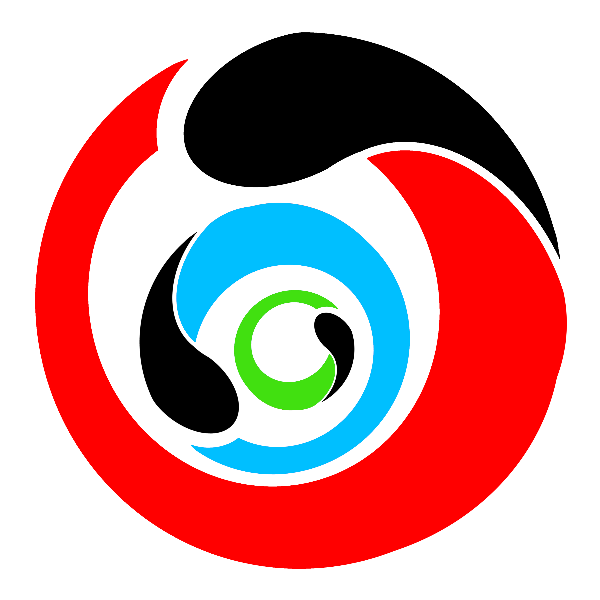

# 画像処理100本ノック!!

- ***English https://github.com/KuKuXia/Image_Processing_100_Questions*** (by KuKuXia)

- ***Chinese https://github.com/gzr2017/ImageProcessing100Wen*** (by gzr2017)

- ***Study-AI株式会社様 http://kentei.ai/ のAI実装検定のシラバスに使用して頂いています。検定も実施されてるので、ご興味ある方はぜひ！***

イモリと一緒に画像処理のアルゴリズムを理解するための100本ノックです。

- 【注意】このページを利用して、または関して生じた事に関しては、私は一切責任を負いません。すべて**自己責任**でお願い致します。
- **あくまで趣味ベースで作ったものなので、プルリクエストは受け付けてますが依頼などは一切受け付けません
そこをご理解頂けた方のみご利用下さい**


## 問題

### [チュートリアル](questions/tutorial)

画像は↓コードで読み込めます

```python
from skimage import io
img = io.imread('https://yoyoyo-yo.github.io/Gasyori100knock/dataset/images/imori_256x256.png')
```

使える画像 >> dataset/images 

|||||
|:---:|:---:|:---:|:---:|
|  | imori_128x128.png <br> imori_256x256.png <br> imori_512x512.png |  | madara_128x128.png <br> madara_256x256.png <br>  madara_512x512.png| 
|   | imori_256x256_noise.png |  | imori_256x256_dark.png 
|  | imori_256x256_light.png |  | imori_256x256_gamma.png


## [問題1 - 10](questions/question_01_10)


|番号|問題| |番号|問題|
|:---:|:---:|:---:|:---:|:---:|
| 1 | [チャネル入れ替え](questions/question_01_10#q1-チャネル入れ替え) || 6 | [減色処理](questions/question_01_10#q6-減色-color-subtraction)
| 2 | [グレースケール化](questions/question_01_10#q2-グレースケール-grayscale) || 7 | [平均プーリング](questions/question_01_10#q7-平均プーリング-average-pooling)
| 3 | [二値化](questions/question_01_10#q3-二値化-binarization) || 8 | [Maxプーリング](questions/question_01_10#q8-最大プーリング-max-pooling)
| 4 | [大津の二値化](questions/question_01_10#q4-大津の二値化-otsus-binarization) || 9 | [ガウシアンフィルタ](questions/question_01_10#q9-ガウシアンフィルタ-gaussian-filter)
| 5 | [HSV変換](questions/question_01_10#q5-hsv変換-hsv-transformation) || 10 | [メディアンフィルタ](questions/question_01_10#q10-メディアンフィルタ-median-filter)

## [問題11 - 20](questions/question_11_20)

|番号|問題| |番号|問題|
|:---:|:---:|:---:|:---:|:---:|
| 11 | [平滑化フィルタ](questions/question_11_20#q11-平滑化フィルタ-smoothing-filter) || 16 | [Sobelフィルタ](questions/question_11_20#q16-ソーベルフィルタ-sobel-filter)
| 12 | [モーションフィルタ](questions/question_11_20#q12-モーションフィルタ-motion-filter) || 17 | [Laplacianフィルタ](questions/question_11_20#q17-ラプラシアンフィルタ-laplacian-filter)
| 13 | [MAX-MINフィルタ](questions/question_11_20#q13-max-minフィルタ-max-min-filter) || 18 |  [Embossフィルタ](question_11_20#q18-エンボスフィルタ-emboss-filter)
| 14 | [微分フィルタ](questions/question_11_20#q14-微分フィルタ-differential-filter) || 19 | [LoGフィルタ](questions/question_11_20#q19-logフィルタ-log-filter)
| 15 | [Prewittフィルタ](questions/question_11_20#q15-プリューウィットフィルタ-prewitt-filter) || 20 | [ヒストグラム表示](questions/question_11_20#q20-ヒストグラム表示)

## [問題21 - 30](questions/question_21_30#question-21---30) 

|番号|問題| |番号|問題|
|:---:|:---:|:---:|:---:|:---:|
|21| [ヒストグラム正規化](questions/question_21_30#q21-ヒストグラム正規化-histogram-normalization) ||26| [Bi-linear補間](questions/question_21_30#q26-バイリニア補間-bi-linear-interpolation)
|22| [ヒストグラムのスケーリングとシフト](questions/question_21_30#q22-ヒストグラムのスケーリングとシフト-histogram-scaling-and-shift) ||27| [Bi-cubic補間](questions/question_21_30#q27-bi-cubic補間)
| 23| [ヒストグラム平坦化](questions/question_21_30#q23-ヒストグラム平坦化-histogram-equalization) | |28| [アフィン変換(平行移動)](questions/question_21_30#q28-アフィン変換平行移動-affine-shift) |
| 24| [ガンマ補正](questions/question_21_30#q24-ガンマ補正-gamma-correction) | |29| [アフィン変換(拡大縮小)](questions/question_21_30#q29-アフィン変換拡大縮小-affine-scale)
|25| [最近傍補間](questions/question_21_30#q25-最近傍補間-nearest-nighbor-interpolation-nn法) | |30| [アフィン変換(回転)](questions/question_21_30#q30-アフィン変換回転-affine-rotation) |


### [問題31 - 40](questions/question_31_40)

|番号|問題| |番号|問題|
|:---:|:---:|:---:|:---:|:---:|
|31| [アフィン変換(スキュー)](questions/question_31_40#q31-アフィン変換スキュー) | | 36| [JPEG圧縮 (Step.1)離散コサイン変換](questions/question_31_40#q36-jpeg圧縮-step1離散コサイン変換) 
|32| [フーリエ変換](questions/question_31_40#q32-フーリエ変換) ||37| [PSNR](questions/question_31_40#q37-psnr) | 
|33| [フーリエ変換 ローパスフィルタ](questions/question_31_40#q33-フーリエ変換ローパスフィルタ) | |38| [JPEG圧縮 (Step.2)DCT+量子化](questions/question_31_40#q38-jpeg圧縮-step2dct量子化) 
|34| [フーリエ変換 ハイパスフィルタ](questions/question_31_40#q34-フーリエ変換ハイパスフィルタ)  ||39| [JPEG圧縮 (Step.3)YCbCr表色系](questions/question_31_40#q39-jpeg圧縮-step3ycbcr表色系)
|35| [フーリエ変換 バンドパスフィルタ](questions/question_31_40#q35-フーリエ変換バンドパスフィルタ) | | 40| [JPEG圧縮 (Step.4)YCbCr+DCT+量子化](questions/question_31_40#q40-jpeg圧縮-step4ycbcrdct量子化) 


### [問題41 - 50](questions/question_41_50)

|番号|問題| |番号|問題|
|:---:|:---:|:---:|:---:|:---:|
| 41 | [Cannyエッジ検出 (Step.1) エッジ強度](questions/question_41_50#q41-cannyエッジ検出-step1-エッジ強度) | | 46 | [Hough変換・直線検出 (Step.3) Hough逆変換](questions/question_41_50#q46-hough変換直線検出-step3-hough逆変換)
| 42 | [Cannyエッジ検出 (Step.2) 細線化](questions/question_41_50#q42-cannyエッジ検出-step2-細線化) | | 47 | [モルフォロジー処理(膨張)](questions/question_41_50#q47-モルフォロジー処理膨張)
| 43 | [Cannyエッジ検出 (Step.3) ヒステリシス閾処理](questions/question_41_50#q43-cannyエッジ検出-step3-ヒステリシス閾処理) | | 48 | [モルフォロジー処理(収縮)](questions/question_41_50#q48-モルフォロジー処理収縮)
| 44| [Hough変換・直線検出 (Step.1) Hough変換](questions/question_41_50#q44-hough変換直線検出-step1-hough変換) | | 49 | [オープニング処理](questions/question_41_50#q49-オープニング処理) 
| 45| [Hough変換・直線検出 (Step.2) NMS](questions/question_41_50#q45-hough変換直線検出-step2-nms) || 50 | [クロージング処理](questions/question_41_50#q50-クロージング処理)


### [問題51 - 60](questions/question_51_60)

|番号|問題|  |番号|問題|
|:---:|:---:|:---:|:---:|:---:|
| 51 | [モルフォロジー勾配](questions/question_51_60#q51-モルフォロジー勾配) | | 56 | [テンプレートマッチング NCC](questions/question_51_60#q56-テンプレートマッチング-ncc)
|52|[トップハット変換](questions/question_51_60#q52-トップハット変換) | | 57 | [テンプレートマッチング ZNCC](questions/question_51_60#q57-テンプレートマッチング-zncc)
| 53 | [ブラックハット変換](questions/question_51_60#q53-ブラックハット変換)  |  | 58 | [ラベリング 4近傍](questions/question_51_60#q58-ラベリング-4近傍)
| 54 | [テンプレートマッチング SSD](questions/question_51_60#q54-テンプレートマッチング-ssd) | | 59 | [ラベリング 8近傍](questions/question_51_60#q59-ラベリング-8近傍) 
| 55 | [テンプレートマッチング SAD](questions/question_51_60#q55-テンプレートマッチング-sad) | | 60 | [アルファブレンド](questions/question_51_60#q60-アルファブレンド) 


### [問題61 - 70](questions/question_61_70)

|番号|問題| |番号|問題| 
|:---:|:---:|:---:|:---:|:---:|
| 61 | [4-連結数](questions/question_61_70#q61-4-連結数) | | 66 | [HOG (Step.1) 勾配強度・勾配角度](questions/question_61_70#q66-hog-step1-勾配強度勾配角度)
| 62 | [8-連結数](questions/question_61_70#q62-8-連結数) | | 67 | [HOG (Step.2) 勾配ヒストグラム](questions/question_61_70#q67-hog-step2-勾配ヒストグラム)
| 63 | [細線化](questions/question_61_70#q63-細線化処理) | | 68 | [HOG (Step.3) ヒストグラム正規化](questions/question_61_70#q68-hog-step3-ヒストグラム正規化)
| 64 | [ヒルディッチの細線化](questions/question_61_70#q64-ヒルディッチの細線化) | | 69 | [HOG (Step.4) 特徴量の描画](questions/question_61_70#q69-hog-step4-特徴量の描画)
| 65 | [Zhang-Suenの細線化](questions/question_61_70#q65-zhang-suenの細線化) | | 70 | [カラートラッキング](questions/question_61_70#q70-カラートラッキング)

### [問題71 - 80](questions/question_71_80)

|番号|問題| |番号|問題|
|:---:|:---:|:---:|:---:|:---:|
| 71 | [マスキング](questions/question_71_80#q71-マスキング) | | 76 | [顕著性マップ](questions/question_71_80#q76-顕著性マップ) | 
| 72 | [マスキング(カラートラッキングとモルフォロジー)](questions/question_71_80#q72-マスキングカラートラッキングモルフォロジー) || 77 | [ガボールフィルタ](questions/question_71_80#q77-ガボールフィルタ)
| 73 | [縮小と拡大](questions/question_71_80#q73-縮小と拡大) || 78 | [ガボールフィルタの回転](questions/question_71_80#q78-ガボールフィルタの回転) 
| 74 | [ピラミッド差分による高周波成分の抽出](questions/question_71_80#q74-ピラミッド差分による高周波成分の抽出) | | 79 | [ガボールフィルタによるエッジ抽出](questions/question_71_80#q79-ガボールフィルタによるエッジ抽出) 
| 75 | [ガウシアンピラミッド](questions/question_71_80#q75-ガウシアンピラミッド)  || 80 | [ガボールフィルタによる特徴抽出](questions/question_71_80#q80-ガボールフィルタによる特徴抽出)

### [問題81 - 90](questions/question_81_90)

|番号|問題| |番号|問題|
|:---:|:---:|:---:|:---:|:---:|
| 81 | [Hessianのコーナー検出](questions/question_81_90#q81-hessianのコーナー検出) | | 86 | [簡単な画像認識 (Step.3) 評価(Accuracy)](questions/question_81_90#q86-簡単な画像認識-step3-評価accuracy)
| 82 | [Harrisのコーナー検出 (Step.1) Sobel + Gaussian](questions/question_81_90#q82-harrisのコーナー検出-step1-sobel--gauusian) || 87 | [簡単な画像認識 (Step.4) k-NN](questions/question_81_90#q87-簡単な画像認識-step4-k-nn) 
| 83 | [Harrisのコーナー検出 (Step.2) コーナー検出](questions/question_81_90#q83-harrisのコーナー検出-step2-コーナー検出) | | 88 | [K-means (Step.1) 重心作成](questions/question_81_90#q88-k-means-step1-重心作成)
| 84 | [簡単な画像認識 (Step.1) 減色化 + ヒストグラム](questions/question_81_90#q84-簡単な画像認識-step1-減色化--ヒストグラム) | | 89 | [K-means (Step.2) クラスタリング](questions/question_81_90#q89-k-means-step2-クラスタリング)
| 85 | [簡単な画像認識 (Step.2) クラス判別](questions/question_81_90#q85-簡単な画像認識-step2-クラス判別) | | 90 | [K-means データを増やす](questions/question_81_90#q90-k-means-データを増やす)

### [問題91 - 100](questions/question_91_100)

|番号|問題| |番号|問題|
|:---:|:---:|:---:|:---:|:---:|
| 91 | [K-meansによる減色処理 (Step.1) 色の距離によるクラス分類](questions/question_91_100#q91-k-meansによる減色処理-step1-色の距離によるクラス分類) | | 96 | [ニューラルネットワーク (Step.2) 学習](questions/question_91_100#q96-ニューラルネットワーク-step2-学習) 
| 92 | [K-meansによる減色処理 (Step.2) 減色処理](questions/question_91_100#q92-k-meansによる減色処理-step2-減色処理) | | 97 | [簡単な物体検出 (Step.1) スライディングウィンドウ + HOG](questions/question_91_100#q97-簡単な物体検出-step1-スライディングウィンドウ--hog) 
| 93 | [機械学習の学習データの用意 (Step.1) IoUの計算](questions/question_91_100#q93-機械学習の学習データの用意-step1-iouの計算)  | | 98 | [簡単な物体検出 (Step.2) スライディングウィンドウ + NN](questions/question_91_100#q98-簡単な物体検出-step2-スライディングウィンドウ--nn)
| 94 | [機械学習の学習データの用意 (Step.2) ランダムクラッピング](questions/question_91_100#q94-機械学習の学習データの用意-step2-ランダムクラッピング) | | 99 | [簡単な物体検出 (Step.3) Non-Maximum Suppression](questions/question_91_100#q99-簡単な物体検出-step3-non-maximum-suppression)
| 95 | [ニューラルネットワーク (Step.1) 使ってみる](questions/question_91_100#q95-ニューラルネットワーク-step1-使ってみる) || 100 | [簡単な物体検出 (Step.4) 評価 Precision, Recall, F-score, mAP](questions/question_91_100#q100-簡単な物体検出-step4-評価-precision-recall-f-score-map)


## TODO

adaptivebinalizatino, poison image blending, saliency map


## License

- This is MIT License https://github.com/yoyoyo-yo/Gasyori100knock/blob/master/LICENSE
- OpenCV is Apache License Version 2.0 https://github.com/opencv/opencv/blob/master/LICENSE
- opencv-python is MIT License https://github.com/opencv/opencv-python/blob/master/LICENSE.txt